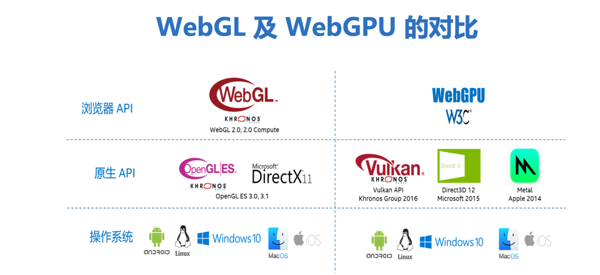

# 浏览器底层原理, W3C规范及API

## 深入浏览器机制 

*参考资料*

- [Chromium Design Documents](https://github.com/chromium/chromium/tree/master/docs)
- [Chromium中文文档](https://www.bookstack.cn/books/Chromium_doc_zh) 及 [github](https://github.com/ahangchen/Chromium_doc_zh)
- [理解WebKit和Chromium](https://blog.csdn.net/milado_nju/article/details/7216067)
- [图解浏览器的工作原理](https://www.infoq.cn/article/CS9-WZQlNR5h05HHDo1b)
- [Web 性能](https://developer.mozilla.org/zh-CN/docs/Web/Performance) 及 [渲染页面：浏览器的工作原理](https://developer.mozilla.org/zh-CN/docs/Web/Performance/How_browsers_work)

## WebRTC实时通信

## WebAssembly汇编

​	详见: [WASM学习](../Wasm/README.md)

## WebGPU计算与渲染

1. WebGL vs WebGPU

    

    1. 深入WebGPU
    2. 深入Vulkan

2. 下载Edge浏览器, /opt/microsoft/msedge-dev/msedge --enable-unsafe-webgpu --enable-features=Vulkan,UseSkiaRenderer

    ```sh
    https://www.microsoftedgeinsider.com/zh-cn/download #PC版
    https://www.microsoftedgeinsider.com/zh-cn/download?platform=android #安卓版
    ```

    

3. Intel GPU工具

    ```sh
    sudo apt-get install intel-gpu-tools
    sudo intel_gpu_top #查看GPU使用情况
    ```

*参考资料*

- [about-os - Linux图形子系统](https://gitee.com/yejinlei/about-os/blob/master/humaninterface/hi/graphics/Linux%E5%9B%BE%E5%BD%A2%E5%AD%90%E7%B3%BB%E7%BB%9F.md)
- [WebGL Overview](https://www.khronos.org/webgl/)
- [WebGL 2.0 Compute 已废弃](https://www.khronos.org/registry/webgl/specs/latest/2.0-compute/)
- [WebGPU Editor’s Draft, 18 August 2021](https://gpuweb.github.io/gpuweb/)
- [WebGPU Explainer Living Standard, 18 August 2021](https://gpuweb.github.io/gpuweb/explainer/)
- [html dom和canvas 2d和webgl的性能对比](https://zhuanlan.zhihu.com/p/350323062), 打开观察CPU和Intel GPU使用情况
  - dom: https://wow.techbrood.com/uploads/2101/perf_test/dom.html
  - canvas (2d): https://wow.techbrood.com/uploads/2101/perf_test/canvas.html
  - webgl: https://wow.techbrood.com/uploads/2101/perf_test/webgl.html
- GPU.js, https://gpu.rocks
- [WebGPU Samples](http://austin-eng.com/webgpu-samples)
- [From 0 to glTF with WebGPU: The First Triangle](https://www.willusher.io/graphics/2020/06/15/0-to-gltf-triangle)
- [GPU加速在前端的应用](https://juejin.cn/post/6965810210283716644)
- [使用GPU.js让你的Angular.js程序提速10倍](https://juejin.cn/post/6965657517376569380)

## WebXR虚拟/增强/混合现实

*参考资料*

- [WebXR API Emulator by Mozilla Mixed Reality](https://addons.mozilla.org/en-US/firefox/user/15240799/)
- [WebXR 设备 接口参考](https://developer.mozilla.org/zh-CN/docs/Web/API/WebXR_Device_API)
- [Fundamentals of WebXR](https://developer.mozilla.org/en-US/docs/Web/API/WebXR_Device_API/Fundamentals)
- [hello-webxr demo](https://mixedreality.mozilla.org/hello-webxr/)
- [webxr samples](https://immersive-web.github.io/webxr-samples/)
- [WebXR Overview](https://docs.microsoft.com/en-us/windows/mixed-reality/develop/javascript/webxr-overview)
- [firefox reality](https://mixedreality.mozilla.org/firefox-reality/)