# 有关ELF #

## ELF类型 ##
	readelf -h 目标文件 | grep Type  #查看ELF类型
	relocatable（可重定位）：.o文件、.a文件
	executable（可执行）：
	shared libarary（共享库）：.so
	core dump（核心转储文件）
	
## ELF文件格式 ##
- 显示所有节表信息，objdump -s bin
- 全部符号表.symtab和动态链接时需要的动态符号表.dynsym(动态加载的可执行文件)，readelf -s bin
- 显示重定位节信息，readelf -r bin
	- .rela.dyn节和.rela.plt节（动态加载的可执行文件）或使用objdump -R bin
	- .rela.plt节（静态编译的可执行文件）
	- .rela.text节和.rela.eh_frame节（目标文件.o）
- .interp段指向的解释器所需要的信息.dynamic（动态加载的可执行文件），readelf -d bin或objdump -T bin

*备注：*

- 静态编译的可执行文件，gcc -static，无需.interp、.dynamic、.rela.dyn段
- 链接相关：-static静态编译参数，-nostdlib不链接标准库
- .shstrtab节存放着所有节名称
- .symtab节存放的符号表，不是标准的字符串,不能使用readelf -p.symtab bin，而要使用-s或objdump -t bin

### ELF文件的链接视图和执行视图
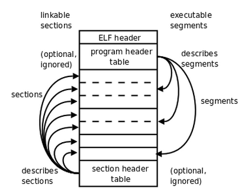

### 节区头部数据结构
	typedef struct{
		Elf32_Word sh_name;		//节区名,  .开头节区名称通常为系统保留
		Elf32_Word sh_type;		//节区类型，↓
									1、SHT_NULL，取值0，非活动没有节区，节区头部其他成员无意义
									2、SHT_PROGBITS，取值1，目标文件自定义区，由程序解释
									3、SHT_SYMTAB，取值2，该节区包含一个符号表，目标文件只能包含一个
									4、SHT_STRTAB，取值3，该节区包含一个字符串表，目标文件可以包含多个
									5、SHT_RELA，取值4，该节区包含重定位表项,可能会有补齐，目标文件可以包含多个
									6、SHT_HASH，取值5，该节区包含一个符号hash表，与动态链接有关，目标文件只能包含一个
									7、SHT_DYNAMIC，取值6，该节区包含动态链接的信息，目标文件只能包含一个
									8、SHT_NOTE，取值7，该节区包含文件的信息
									9、SHT_NOBITS，取值8，不占用目标文件空间
									10、SHT_REL，取值9，该节区包含重定位表项,不补齐，目标文件可以包含多个
									11、SHT_SHLIB，取值10，语义未规定
									12、SHT_DYNSYM，取值11，最小的符号集合，节省空间
							
		Elf32_Word sh_flags;	//节区属性，↓
									1、SHF_WRITE，取值0x1，可写属性
									2、SHF_ALLOC，取值0x2，占用内存
									3、SHF_EXECINSTR，取值0x4，可执行
									4、SHF_MASKPROC，取值0xF0000000，专用
		Elf32_Addr sh_addr;
		Elf32_Off sh_offset;
		Elf32_Word sh_size;
		Elf32_Word sh_link;
		Elf32_Word sh_info;
		Elf32_Word sh_addralign;
		Elf32_Word sh_entsize;
	}Elf32_Shdr;

### 特殊节区

| 名称               | 类型         | 属性 | 含义                                                         |
| ------------------ | ------------ | ---- | ------------------------------------------------------------ |
| .bss               |              |      |                                                              |
| .shstrtab          | SHT_STRTAB   |      | 包含节区名称 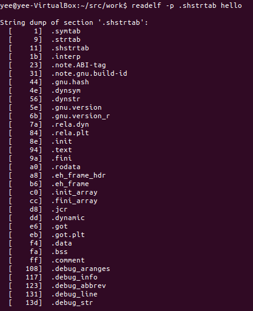                        |
| .initerp           | SHT_PROGBITS |      | 目标文件运行时，用于搜索依赖的glibc共享库 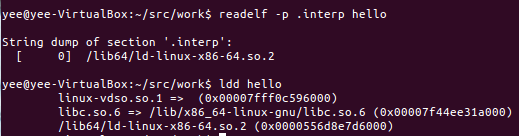 |
| .comment           | SHT_PROGBITS |      | OS和GCC版本信息 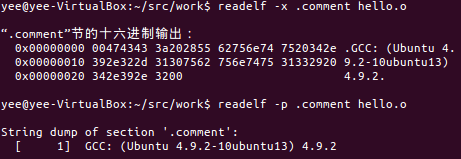                      |
| .note.abi.tag      | SHT_NOTE     |      | readelf -n obj 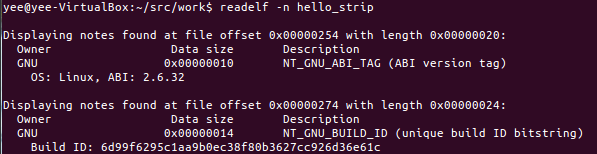                  |
| .note.gnu.build-id | SHT_NOTE     |      | readelf -n obj               |
| .rela.[name]       | SHT_RELA     |      | readelf -r obj 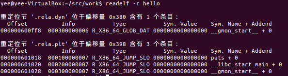                          |
| .dynsym            | SHT_DYNSYM   |      | 包含动态链接符号表，readelf --dyn-syms/-s obj 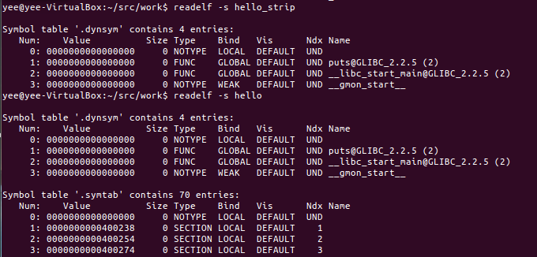 |

.symtab			|SHT_SYMTAB	     |				  |	包含一个符号表，readelf -s obj，strip会删除该区 

### 实验
#### readelf -all(strip处理后、没有-g选项，-g选项)
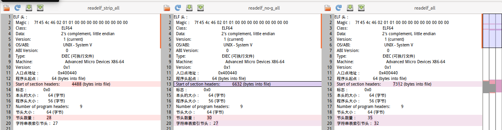
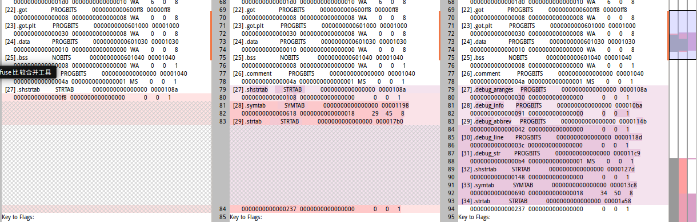

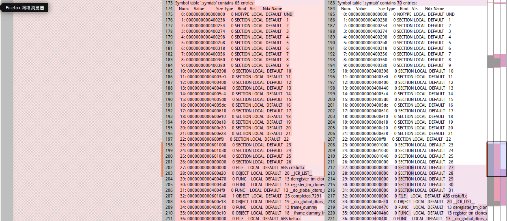

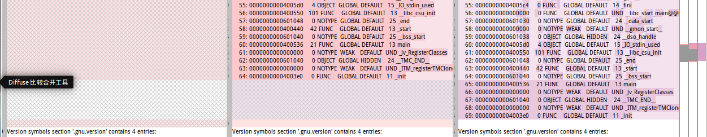

## 连接：生成ELF ##
## 加载：加载ELF ##
- sys\_execve
	- do\_execve
		- do\_execveat_common
			- do\_open_execat
			- sched\_exec
			- bprm\_mm_init，**初始化linux\_binprm数据结构**
			- exec\_binprm
				- search\_binary_handler
					- list\_for\_each_entry(fmt, &formats, lh) {，//遍历formats,
						- fmt->load_binary(bprm)，**加载linux\_binfmt数据结构**
							- case ELF：load\_elf_library
								- kernel_read从file读取ELF头部elfhdr
		
										typedef struct
										{
										  		unsigned char e_ident[EI_NIDENT];     /* 魔数和相关信息 */
										  		Elf32_Half    e_type;                 /* 目标文件类型 */
										  		Elf32_Half    e_machine;              /* 硬件体系 */
										  		Elf32_Word    e_version;              /* 目标文件版本 */
										  		Elf32_Addr    e_entry;                /* 程序进入点 */
										  		Elf32_Off     e_phoff;                /* 程序头部偏移量 */
										  		Elf32_Off     e_shoff;                /* 节头部偏移量 */
										  		Elf32_Word    e_flags;                /* 处理器特定标志 */
										  		Elf32_Half    e_ehsize;               /* ELF头部长度 */
										  		Elf32_Half    e_phentsize;            /* 程序头部中一个条目的长度 */
										  		Elf32_Half    e_phnum;                /* 程序头部条目个数  */
										  		Elf32_Half    e_shentsize;            /* 节头部中一个条目的长度 */
										  		Elf32_Half    e_shnum;                /* 节头部条目个数 */
										  		Elf32_Half    e_shstrndx;             /* 节头部字符表索引 */
										} Elf32_Ehdr;

								- 校验ELF头部信息
								- elf_phdr段表数据结构申请空间
								- kernel\_read从file偏移e_phoff读取段表信息()
								
										typedef struct {
										  Elf32_Word  p_type;				/* 段类型 */
										  Elf32_Off   p_offset;     	 	/* 段位置相对于文件开始处的偏移量 */
										  Elf32_Addr  p_vaddr;   			/* 段在内存中的地址 */
										  Elf32_Addr  p_paddr;   			/* 段的物理地址 */
										  Elf32_Word  p_filesz;				/* 段在文件中的长度 */
										  Elf32_Word  p_memsz;				/* 段在内存中的长度 */
										  Elf32_Word  p_flags;				/* 段的标记 */
										  Elf32_Word  p_align;				/* 段在内存中对齐标记 */
									  } Elf32_Phdr;

								- vm_mmap映射到内存
					- put_binfmt	
- struct linux_binprm数据结构，存放可执行关键数据
- struct linux_binfmt数据结构，存放解释器关键数据
	- elf\_format，elf解释器
		- module		= THIS_MODULE,
		- .load\_binary	= **load\_elf_binary**,
		- .load\_shlib	= load\_elf_library,
		- .core\_dump	= elf\_core_dump,
		- .min\_coredump	= ELF\_EXEC_PAGESIZE,
- register_binfmt,注册binfmt