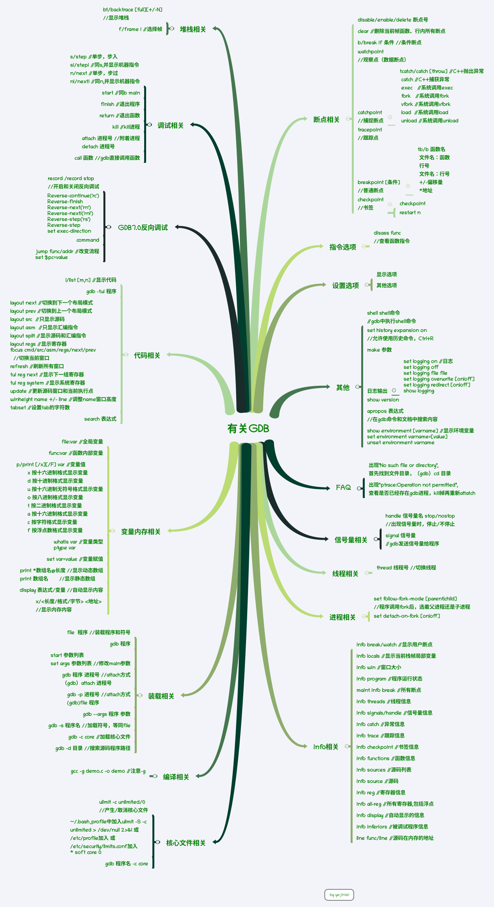

# b有关GDB

## 一. 思维导图



## 二. 图形化GDB
### gdbtui

```shell
pip install pipx
pipx install gdbtui
gdbtui -p 10001 -r
chrome http://127.0.1.1:10001/
```


## 三. 参考资料

1. [GDB在线手册](https://sourceware.org/gdb/onlinedocs/gdb/)
2. [hellogcc/100-gdb-tips](https://github.com/hellogcc/100-gdb-tips)

