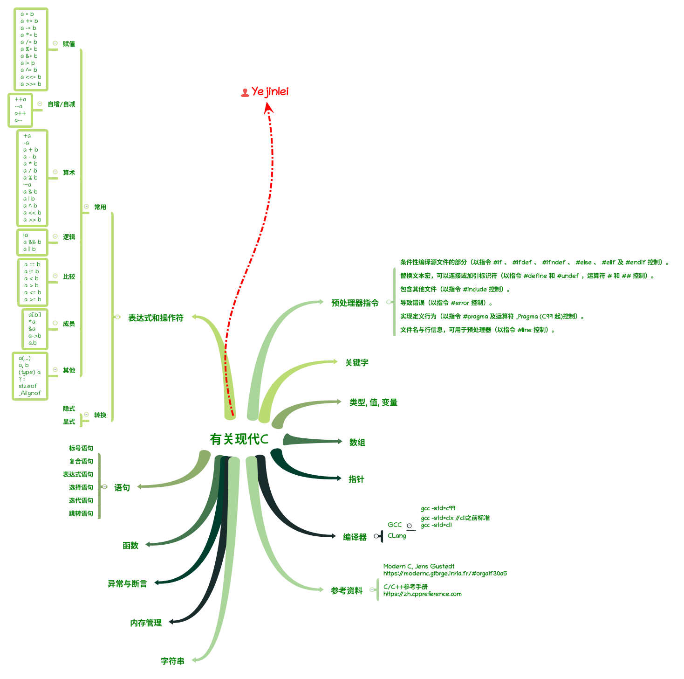

# C/C++语言™ [coliru online compiler](https://coliru.stacked-crooked.com/)

### 参考资料

1. [cppreference.com](https://zh.cppreference.com/)
2. [The Boost C++ Libraries](https://theboostcpplibraries.com/), [Boost C++ 库](http://zh.highscore.de/cpp/boost/)
3. [How to Think Like a Computer Scientist: C++ Version](https://runestone.academy/runestone/books/published/thinkcpp/index.html)
4. [Programming Abstractions in C++](https://tfetimes.com/wp-content/uploads/2015/04/Prog-in-Cpp.pdf)
5. [Think C](https://github.com/tscheffl/ThinkC), [ThinkCPP](https://www.greenteapress.com/thinkcpp/thinkCScpp.pdf), [练习题](https://runestone.academy/runestone/books/published/thinkcpp/index.html)
6. [Open Data Structures (in C++)](http://opendatastructures.org/ods-cpp.pdf), [others](http://opendatastructures.org/)
7. [C++ compiler support](https://en.cppreference.com/w/cpp/compiler_support) & [C++ Support in Clang](https://clang.llvm.org/cxx_status.html)
8. [Rainer Grimm's modernes c++](http://www.modernescpp.com/index.php)

