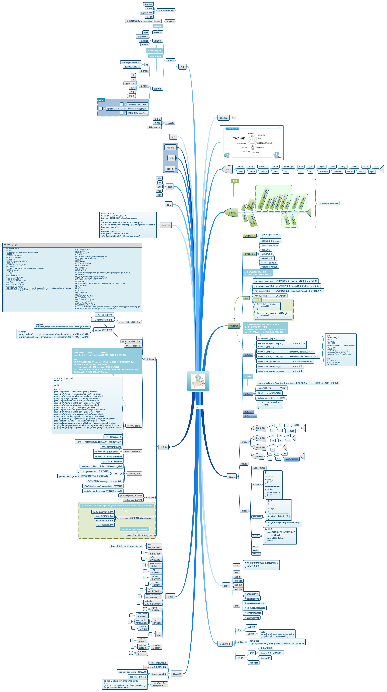

# Go语言™

---

## 一. 专题学习

### 文件系统

### 字符串&正则表达式

- *正则规则*


### 并发并行

<!--先看几个反例-->

- *数据竞争问题*

```Go
package main

import (
	"fmt"
	_ "time"
)

func main() {
	var data int
	go func() {
 		data++
	}()
	//time.Sleep(10000)
	fmt.Printf("data值 %v.\n", data)
}
```

### 网络编程

### 调试与跟踪

go tool trace & pprof

### 测试框架

### Cgo & FFI & [Swig](http://www.swig.org/Doc2.0/Go.html) & [c2goasm](https://github.com/minio/c2goasm)编程

### 图形界面

* 目前Qt for Golang三种方案:

  2. [visualfc / goqt](https://github.com/visualfc/goqt)
  2. [kitech / qt.go](https://github.com/kitech/qt.go), 主要采用libffi方式, 核心代码:
     1. init(qtrt/ffi_invoke.go)
        1. init_ffi_invoke
           1. NewFFILibrary加载so(gtrt/[ffi_wrapper.go](https://github.com/kitech/qt.go/blob/58034ab430328f0bcd1e15a24909abb6d0ef9a19/qtrt/ffi_wrapper.go))
        2. init_so_ffi_call
           1. GetQtSymAddrRaw, 遍历qtlibs, 获取ffi_call_ex和ffi_call_var_ex指针
           2. C.set_so_ffi_call_ex([qtrt/ffi_invoke.c](https://github.com/kitech/qt.go/blob/58034ab430328f0bcd1e15a24909abb6d0ef9a19/qtrt/ffi_invoke.c)), 传入上述指针
     2. InvokeQtFunc5/6/7 
        1. C.ffi_call_ex
           1. ffi_call_ex(qtrt/ffi_invoke.c中实现)
              1. ffi_call(libffi库函数, 需要安装libffi-dev)
  3. [therecipe / go](https://github.com/therecipe/qt)

## 二. 实战案例

1. **项目包管理改造 - apprtc/collider为例 (>go1.11, go module方式)**

	```
	项目中的每个独立包都要建立mod, 自己负责依赖包的管理;
	如果依赖的是本地包, 要明确指定位置;
	```
	
	collider目录树
	```shell
	➜  collider git:(master) ✗ tree -a
		├── README.md
	  	├── collider //collider包
	  	│   ├── client.go
	  	│   ├── client_test.go
	  	│   ├── collider.go
	  	│   ├── collider_test.go
	  	│   ├── dashboard.go
	  	│   ├── dashboard_test.go
	  	│   ├── messages.go
	  	│   ├── room.go
	  	│   ├── roomTable.go
	  	│   └── room_test.go
	  	├── collidermain //main包
	  	│   └── main.go
	  	├── collidertestzsh
	  	│   └── mockrwc.go安装go 1.13及配置代理
	```
	
	```go
	gvm install go1.13 
	gvm use go1.13 
	export GO111MODULE=on
	export GOPROXY=https://goproxy.io
	```
	
	collider子目录改造
	```go
	go mod init yejinlei/collider //生成go.mod
	go mod vendor	//自动下载依赖包, 并放入同级vendor目录下
	
	/*提示错误, 无法找到collidertest包位置*/
	➜  collider git:(master) ✗ go mod vendor                    
	go: finding golang.org/x/net latest
	yejinlei/collider tested by
	yejinlei/collider.test imports
	collidertest: malformed module path "collidertest": missing dot in first path element
	 	 	 	 	 	 	 	 	 	 	 	 	 	 	 	 	 	 	 	
	/*手动修改go.mod, 添加本地包位置*/
	replace collidertest => ../collidertest   //前者代表代码中import部分, 后者代表相对位置
	```
	
	collidermain子目录改造(步骤同上), 因为是package main, 可以生成可执行文件,命令如下:
	
	```go
	go build -mod=vendor
	```
	

## 三. 参考资料

1. [Go文档](https://go-zh.org/doc/)
2. [concurrency in go](https://www.kancloud.cn/mutouzhang/go/596804), [src](https://github.com/kat-co/concurrency-in-go-src)
3. [Go 语言设计与实现](https://draveness.me/golang/)
4. [Go编程时光](http://golang.iswbm.com/en/latest/index.html)
5. [高性能Golang研讨会](https://www.cnblogs.com/sunsky303/p/11077634.html)
6. [Package Management Tools](https://github.com/golang/go/wiki/PackageManagementTools)
7. [Golang⾼级讲义](http://xiaorui.cc/static/golang_advance.pdf)
8. [Go Projects](https://github.com/golang/go/wiki/Projects)
9. [awesome-go](https://github.com/avelino/awesome-go) /[awesome-go.com](https://awesome-go.com/)
10. [Go2编程指南](https://chai2010.cn/go2-book/)
11. [Go语法树入门](https://github.com/chai2010/go-ast-book)
12. [Go语言高级编程](https://github.com/chai2010/advanced-go-programming-book)
13. [Go语言圣经](https://github.com/golang-china/gopl-zh)/[The Go Programming Language](http://www.gopl.io/)
14. [深入解析Go](https://www.cntofu.com/book/3/index.html)
15. [Go 101](https://go101.org/article/101.html)
16. [地鼠文档](http://wen.topgoer.com/)
17. [Go by Example](https://gobyexample.com/)
18. [Go.dev](https://pkg.go.dev/)
19. [learnku Go版块](https://learnku.com/go)
20. [Go内部实现](http://blog.studygolang.com/category/realize/), [Go包](http://blog.studygolang.com/category/package/), [Go基础](http://blog.studygolang.com/category/spec/), [Go实战](http://blog.studygolang.com/category/go实战/)
21. [plan9 assembly完全解析](https://github.com/cch123/golang-notes/blob/master/assembly.md#plan9-assembly-完全解析)
22. [Go Internals](https://go-internals-cn.gitbook.io/go-internals/)
23. [深入CGO编程 by chai2010 (柴树杉)](https://chai2010.cn/gopherchina2018-cgo-talk/#/)