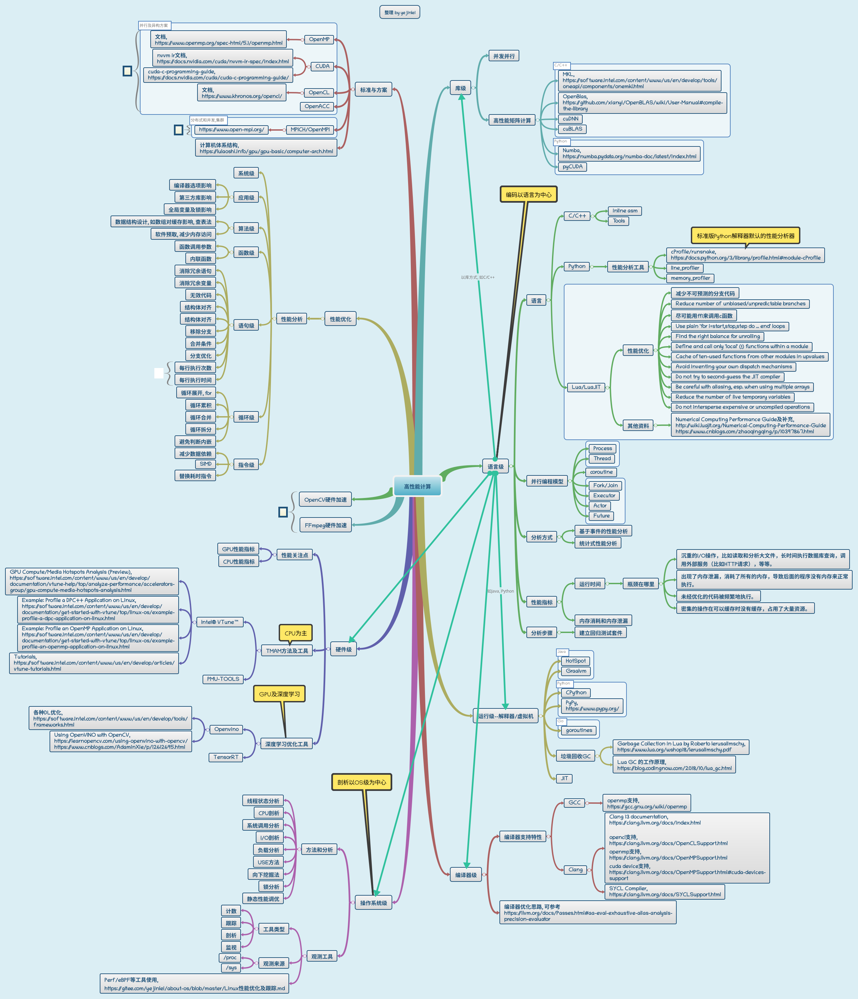

# 高性能计算™

## 语言级

### C/C++性能优化

---

## 并发及第三方高性能库
### OpenMP

---

## 解释器/虚拟机

### JVM 

---

## 编译器级

### Clang/LLVM

### 参考资料

1. Engineer a Compiler
2. Static Single Assignment Book
3. Modern Compiler Implementation in Java/C/ML
4. Parsing Techniques
5. The Definitive ANTLR 4 Reference
6. Advanced Virtual Machine Design and Implementation

---

## 操作系统级

---

## 硬件级

### CPU/PMU/TMAM/VTune

### GPU

### 参考资料

1. [IA-32 Intel架构如那件开发人员手册 卷3:系统编程指南](https://kc.kexinshe.com/r/277831)

---

## 资料汇总

1. [Intel® 64 and IA-32 Architectures Optimization Reference Manual](https://www.intel.com/content/dam/www/public/us/en/documents/manuals/64-ia-32-architectures-optimization-manual.pdf)
2. [Intel® VTune™ Profiler Performance Analysis Cookbook](https://software.intel.com/content/www/us/en/develop/documentation/vtune-cookbook/top/methodologies.html)
3. [Analyzing Open vSwitch* with DPDK Bottlenecks Using Intel® VTune™ Amplifier](https://software.intel.com/content/www/cn/zh/develop/articles/analyzing-open-vswitch-with-dpdk-bottlenecks-using-vtune-amplifier.html)
4. [The microarchitecture of Intel, AMD, and  VIA CPUs An optimization guide for assembly programmers and  compiler makers](https://www.agner.org/optimize/microarchitecture.pdf)
5. [MicroFusion in Intel CPUs](https://easyperf.net/blog/2018/02/15/MicroFusion-in-Intel-CPUs)
6. [分支预测，uOP，乱序执行](https://zhuanlan.zhihu.com/p/349758402)
7. [How TMA* Addresses Challenges in Modern  Servers and Enhancements Coming in  IceLake](https://dyninst.github.io/scalable_tools_workshop/petascale2018/assets/slides/TMA%20addressing%20challenges%20in%20Icelake%20-%20Ahmad%20Yasin.pdf)
8. [Andi Kleen's blog - pmu-tools part I](http://halobates.de/blog/p/245), [pmu-tools](https://github.com/andikleen/pmu-tools), [other fork](https://github.com/Ewenwan/pmu-tools)
9. [Top-Down performance analysis methodology](https://easyperf.net/blog/2019/02/09/Top-Down-performance-analysis-methodology)
10. [Transactional Synchronization Extensions](https://blog.csdn.net/jqwang1992/article/details/53377302)
11. [Performance Prediction Toolkit (PPT)](https://github.com/Ewenwan/PPT)
12. [wiki - Linux kernel profiling with perf](https://perf.wiki.kernel.org/index.php/Tutorial)
13. [pprof++: A Go Profiler with Hardware Performance Monitoring](https://eng.uber.com/pprof-go-profiler/)
14. [CUDA C Programming Guide](https://docs.nvidia.com/cuda/cuda-c-programming-guide/)
15. [CUDA C++ Best Practices Guide](https://docs.nvidia.com/cuda/cuda-c-best-practices-guide/index.html#abstract), [解读《CUDA C最佳实践指南》](https://www.zhihu.com/column/c_1323748466020315136)
16. [阅读CUDA英文手册100天](https://bbs.gpuworld.cn/index.php?board=65.0)
17. [Python通过Numba实现GPU加速](https://blog.csdn.net/The_Time_Runner/article/details/103364257)
18. [使用PYTHON进程GPU编程](https://lulaoshi.info/gpu/gpu-basic/index.html)
19. [Numba for CUDA GPUs](https://numba.pydata.org/numba-doc/latest/cuda/index.html)
20. [CUDA 编程 源码仓库](https://github.com/brucefan1983/CUDA-Programming), [pyCUDA](https://github.com/YouQixiaowu/CUDA-Programming-with-Python)
21. [探讨TensorRT加速AI模型的简易方案—以图像超分为例](https://view.inews.qq.com/a/20210430A019T300)
22. [C/C++ 性能优化背后的方法论：TMAM](https://blog.csdn.net/vivo_tech/article/details/114915671)
23. [BLAS (Basic Linear Algebra Subprograms)](http://www.netlib.org/blas/)
24. [LAPACK — Linear Algebra PACKage](http://www.netlib.org/lapack/)
25. [OpenBLAS](https://github.com/xianyi/OpenBLAS)
26. [NVIDIA深度学习Tensor Core全面解析（上篇）](https://baijiahao.baidu.com/s?id=1610222052714852444&wfr=spider&for=pc)
27. [OpenBLAS gemm从零入门](https://zhuanlan.zhihu.com/p/65436463)
28. [TVM（端到端的优化栈）概述](https://blog.csdn.net/wangbowj123/article/details/97820897)
29. [通过Numba调用CUDA用GPU为Python加速：进阶理解网格跨步、多流、共享内存](https://blog.csdn.net/The_Time_Runner/article/details/103367674?utm_medium=distribute.pc_relevant.none-task-blog-baidujs_title-0&spm=1001.2101.3001.4242)
30. [并行编程OpenMP基础及简单示例](https://blog.csdn.net/u011808673/article/details/80319792)
31. [知乎 - Computer Arch专栏 让CPU黑盒不再黑](https://www.zhihu.com/column/CArch)
32. [CUDA与OpenCL架构](https://www.cnblogs.com/huliangwen/p/5003504.html)
33. [Intel 处理器架构演进](https://jcf94.com/2018/02/13/2018-02-13-intel/)
34. [计算机组成与设计。硬件 / 软件接口 学习笔记（二）](https://jcf94.com/2018/02/06/2018-02-06-cod2/)
35. [C++的性能优化](https://www.eet-china.com/mp/a49760.html)
36. [C++性能优化技术导论](https://blog.csdn.net/iteye_15898/article/details/82236319?utm_medium=distribute.pc_relevant_download.none-task-blog-2~default~BlogCommendFromBaidu~default-2.nonecase&depth_1-utm_source=distribute.pc_relevant_download.none-task-blog-2~default~BlogCommendFromBaidu~default-2.nonecas)

