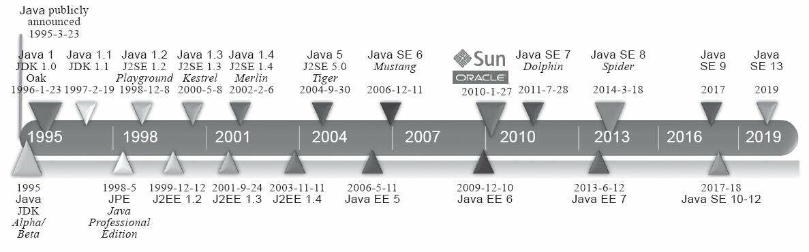
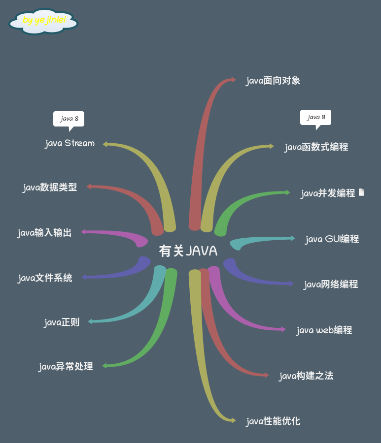
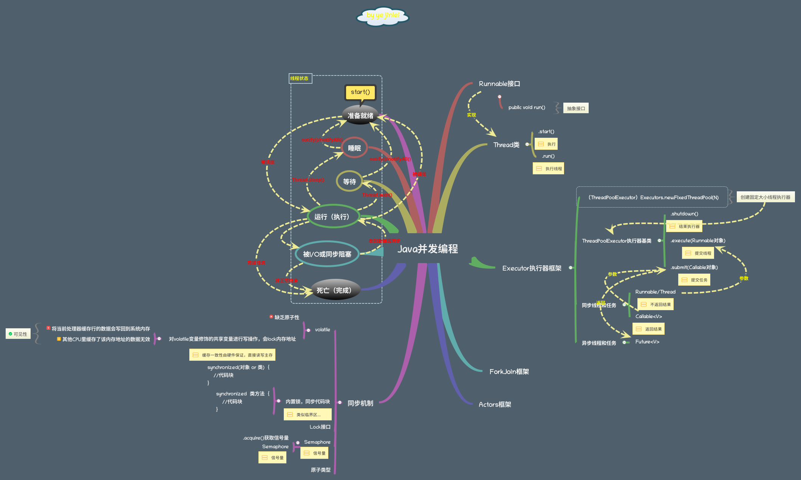

---

# 有关Java™

## Java思维导图

## Java并发编程

- 并发原理
	- volatile
		- 允许线程访问共享变量
- 死锁问题
	- 避免一个线程获得多个锁
	- 避免一个线程一个锁占用多个资源
	- 建议使用定时锁，lock.tryLock（timeout）
- 性能问题
	- 创建线程消耗
	- 上下文切换消耗
		- Lmbench3测量时长、vmsta测量次数
		- 无锁并发编程、CAS算法、少使用线程、使用协程

### 参考资料
1. [Java虚拟机（JVM）你只要看这一篇就够了](https://blog.csdn.net/qq_41701956/article/details/81664921)
2. [javacore](https://github.com/dunwu/javacore)
3. [java并发框架](https://www.cnblogs.com/haimishasha/p/11199944.html)
4. [java并发框架思维导图](https://raw.githubusercontent.com/dunwu/images/dev/snap/20200221175827.png)