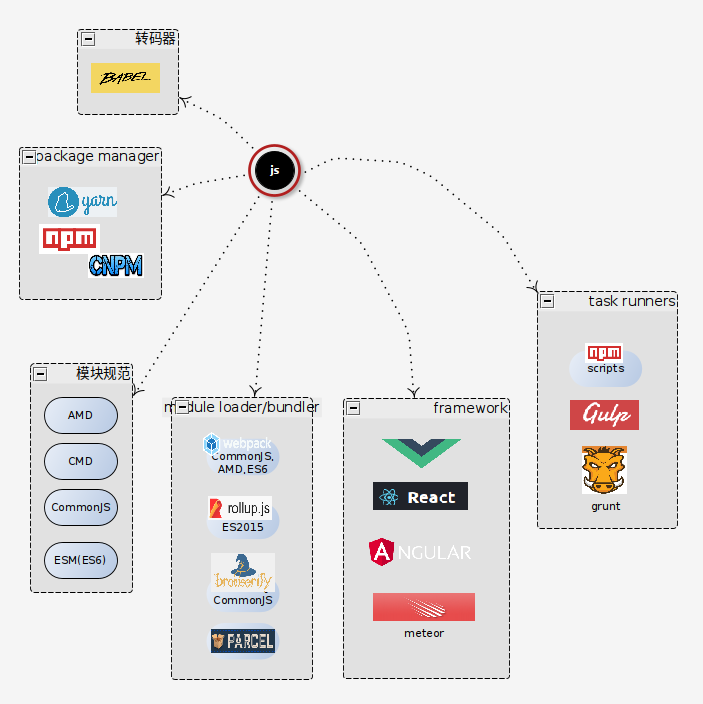

# JavaScript语言™

---

## JavaScript语言及BOM/DOM

## TypeScript语言

## Nodejs运行时

## Deno运行时

## 参考资料
1. [现代JavaScript教程](https://zh.javascript.info/), [EN](https://javascript.info/)
2. [MDN - Javascript](https://developer.mozilla.org/zh-CN/docs/Web/JavaScript), [EN](https://developer.mozilla.org/en-US/docs/Web/JavaScript)