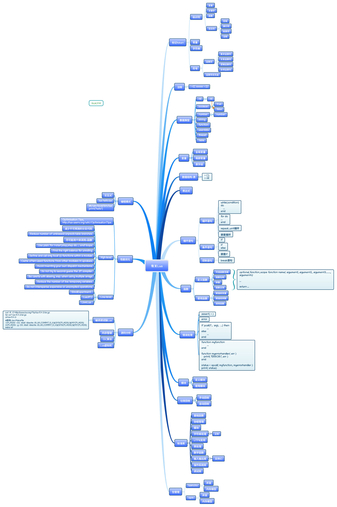

# 有关Lua/LuaJIT™

## 一. Lua基本语法



## 二. Lua源码分析


### 二. Lua源码结构

#### 1. 编译调试版Lua

```shell
diff --git a/src/Makefile b/src/Makefile
index f78c0b8..050893e 100644
--- a/src/Makefile
+++ b/src/Makefile
@@ -7,7 +7,7 @@
 PLAT= guess
 
 CC= gcc -std=gnu99
-CFLAGS= -O2 -Wall -Wextra -DLUA_COMPAT_5_3 $(SYSCFLAGS) $(MYCFLAGS)
+CFLAGS= -g -O0 -Wall -Wextra -DLUA_COMPAT_5_3 $(SYSCFLAGS) $(MYCFLAGS)
 LDFLAGS= $(SYSLDFLAGS) $(MYLDFLAGS)
 LIBS= -lm $(SYSLIBS) $(MYLIBS)
 
 #或者
 make CFLAGS+="-g -O0"
```

#### 2. 编译宏

```shell
make CFLAGS+="-dM -E"
```


#### 3. 函数列表

```GDB
//通过GDB导出所有函数
(gdb) set logging file funcs.txt
(gdb) set logging on 
(gdb) info functions 
(gdb) set logging off
```

*虚拟机核心*

| 文件 | 作用     | 重要函数 |
| :---- | ---- | ---- |
| lua.c | lua主程入口 | main |
| lapi.c | C语言接口 | lua_pcallk |
| ldebug.c | Debug 接口 |      |
| ldo.c | 函数调用以及栈管理 | luaD_pcall<br />luaD_rawrunprotected<br />luaD_closeprotected |
| lfunc.c | 函数原型及闭包管理 | |
| lgc.c | 垃圾回收机制 | |
| lmem.c | 内存管理接口 | luaM_malloc_ |
| lobject.c | 对象操作函数 | |
| lopcodes.c | 虚拟机字节码定义 | |
| lstate.c | 全局状态机 | lua_newstate<br />stack_init |
| lstring.c | 字符串函数 | luaS_hash |
| ltable.c | 表类型的相关操作 |  |
| ltm.c | 元方法 |  |
| lvm.c | 虚拟机 |  |
| lzio.c | 输入流接口 |  |
| | | |

*源代码解析和预编译*

| 文件      | 作用                     | 重要函数 |
| --------- | ------------------------ | -------- |
| lcode.c   | 代码生成器               |          |
| ldump.c   | 序列化预编译的Lua 字节码 |          |
| llex.c    | 词法分析器               |          |
| lparser.c | 解析器                   |          |
| lundump.c | 还原预编译的字节码       |          |
|           |                          |          |

*内嵌库*

| 文件       | 作用                   | 重要函数 |
| ---------- | ---------------------- | -------- |
| lauxlib.c  | 库编写用到的辅助函数库 |          |
| lbaselib.c | 基础库                 |          |
| ldblib.c   | Debug 库               |          |
| linit.c    | 内嵌库的初始化         |          |
| liolib.c   | IO 库                  |          |
| lmathlib.c | 数学库                 |          |
| loadlib.c  | 动态扩展库管理         |          |
| loslib.c   | OS 库                  |          |
| lstrlib.c  | 字符串库               |          |
| ltablib.c  | 表处理库               |          |
|            |                        |          |
*摘自*:https://blog.csdn.net/initphp/article/details/82703846


## 三. LuaJIT源码分析

## 参考资料

1. 官网 [http://www.lua.org/](http://www.lua.org/)
2. [lua教程](https://www.runoob.com/lua/lua-tutorial.html)
3. [Lua 5.3 参考手册](https://www.runoob.com/manual/lua53doc/contents.html)
4. [Lua程序设计](http://www.mianshigee.com/tutorial/LuaBook/)
5. [Lua在线运行](https://www.runoob.com/try/runcode.php?filename=HelloWorld&type=lua)
6. [Azure/golua](https://github.com/Azure/golua)
7. [yuin/gopher-lua](https://github.com/yuin/gopher-lua)
8. [zxh0/lua.go](https://github.com/zxh0/lua.go)
9. [Shopify/go-lua](https://github.com/Shopify/go-lua)
10. [Lua Performance Tips By Roberto Ierusalimschy](http://www.lua.org/gems/sample.pdf)

